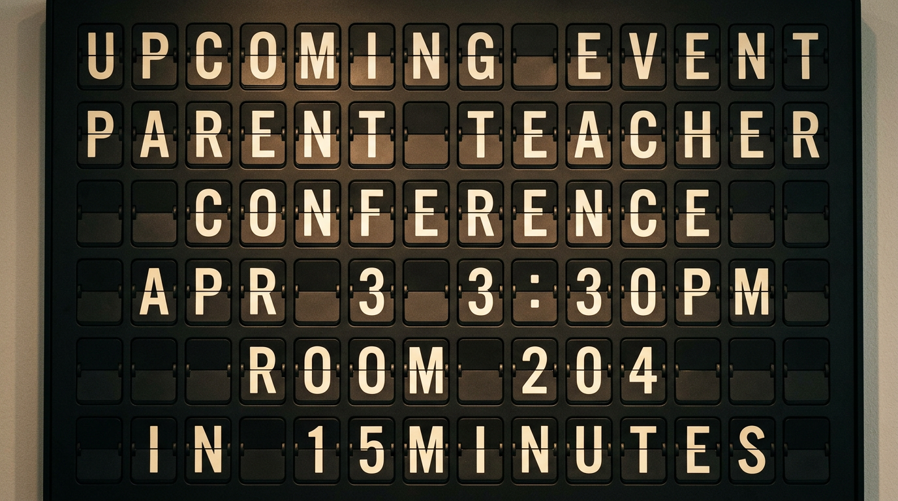

# Calendar Subscription Plugin

Subscribe to any public iCalendar (.ics) URL and display upcoming events on your Vestaboard — with automatic board alerts before events start.



**→ [Setup Guide](./docs/SETUP.md)**

## Overview

The Calendar Subscription plugin fetches any public `.ics` calendar URL (Google Calendar, Outlook, Apple Calendar, school/org calendars, and more) and surfaces upcoming events as template variables. It also supports **event-based triggers**: when an event is within a configurable number of minutes from starting, the board automatically displays the event, then returns to normal operation.

Recurring events (weekly meetings, classes, etc.) are fully expanded, so every occurrence shows up correctly. Both `https://` and `webcal://` URL formats are supported.

## Template Variables

### Next Event

| Variable | Description | Example |
|----------|-------------|---------|
| `{{event_name}}` | Name/title of the next upcoming event | `Parent Teacher Conf` |
| `{{event_start}}` | Formatted start time | `3:30 PM` |
| `{{event_start_date}}` | Formatted start date | `Apr 3` |
| `{{event_end}}` | Formatted end time | `4:30 PM` |
| `{{event_location}}` | Location of the event (if set) | `Room 204` |
| `{{event_description}}` | Description text (truncated) | `Bring report card` |
| `{{minutes_until}}` | Minutes until next event starts | `45` |
| `{{is_now}}` | Whether an event is currently in progress | `false` |

### Upcoming Events

| Variable | Description | Example |
|----------|-------------|---------|
| `{{event_count}}` | Number of upcoming events loaded | `3` |
| `{{events[0].name}}` | Name of the first event | `Weekly Standup` |
| `{{events[0].start}}` | Start time of the first event | `9:00 AM` |
| `{{events[0].start_date}}` | Start date of the first event | `Apr 7` |
| `{{events[0].end}}` | End time of the first event | `9:30 AM` |
| `{{events[0].location}}` | Location of the first event | `Conference Room` |

Use `events[1]`, `events[2]`, etc. for additional events up to `max_events`.

## Example Templates

**Next event display:**
```
UPCOMING EVENT
{{event_name}}

{{event_start_date}}  {{event_start}}
{{event_location}}
IN {{minutes_until}} MIN
```

**Two-event summary:**
```
NEXT UP
{{events[0].name}}
{{events[0].start_date}} {{events[0].start}}
THEN
{{events[1].name}}
{{events[1].start_date}}
```

**Simple reminder:**
```
REMINDER
{{event_name}}
STARTS AT {{event_start}}
ON {{event_start_date}}
```

## Configuration

| Setting | Description | Default |
|---------|-------------|---------|
| `calendar_url` | Public .ics or webcal:// URL (**required**) | — |
| `minutes_before` | Minutes before an event to trigger the board | `15` |
| `display_duration_minutes` | How long the trigger message stays on the board (0 = indefinite) | `0` |
| `timezone` | IANA timezone for all-day events and time display | `America/Los_Angeles` |
| `max_events` | Maximum number of upcoming events to load | `5` |
| `refresh_seconds` | How often to re-fetch the calendar URL (min: 60) | `300` |

### Environment Variables

| Variable | Description |
|----------|-------------|
| `CALENDAR_SUB_URL` | Calendar URL (alternative to setting in UI) |
| `TIMEZONE` | Default IANA timezone |

## Features

- **Universal format support**: Works with any public iCalendar (`.ics`) feed — Google Calendar, Outlook, Apple Calendar, school/org calendars, and more
- **webcal:// support**: Accepts both `https://` and `webcal://` subscription URLs
- **Recurring events**: Fully expands RRULE-based recurring events (weekly meetings, classes, etc.)
- **All-day events**: Displays all-day events with "All Day" instead of a time
- **Event triggers**: Automatically interrupts the board display when an event is approaching
- **Configurable alert window**: Set `minutes_before` to get alerts 5, 15, 30+ minutes in advance
- **Flexible display duration**: Set how long the alert stays on the board, or leave it up until the next scheduled page
- **Multi-event template support**: Access up to 20 upcoming events as template variables for custom layouts

## Author

FiestaBoard Team
